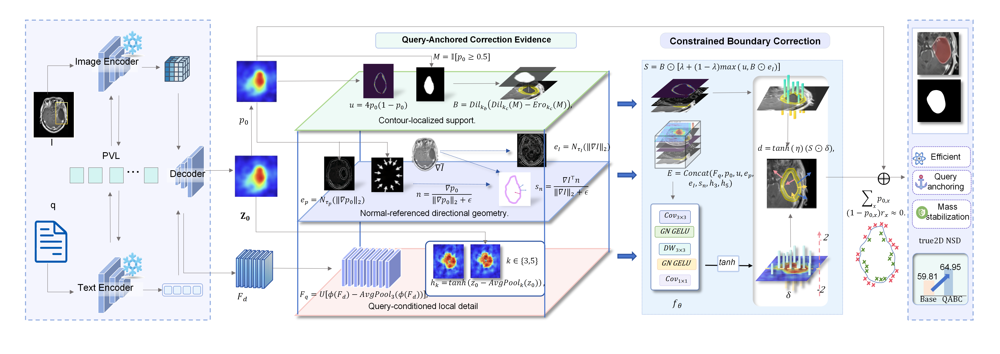

# QABC: Query-Anchored Boundary Correction via Directional Contour Signals for Medical Vision-Language Segmentation

Official implementation of **QABC (Query-Anchored Boundary Correction)**.

**Sizhe Tan**, **Shengchang Wang**, **Panpan Zheng**

School of Computer Science and Technology, Xinjiang University, Ürümqi 830046, China

[**Code**](https://github.com/bessiewelcome78-collab/QABC)

---

## Overview

Text-conditioned medical image segmentation has advanced rapidly, yet semantic correctness does not necessarily guarantee geometric accuracy. A model may correctly identify the queried structure while still retaining local contour errors such as leakage, indentation, or boundary displacement.

Re-predicting the complete mask may repair these errors, but it also introduces unnecessary freedom and can disturb regions that are already correctly localized.

QABC therefore focuses on a more constrained problem: **repairing residual boundary errors while preserving the existing semantic prediction**. The current query-conditioned prediction is treated as a semantic anchor, and QABC learns only a bounded local correction around its established decision contour.

<p align="center">
  <a href="assets/qabr_motivation.pdf">
    <b>View QABC Motivation Figure (PDF)</b>
  </a>
</p>

<p align="center">
  <em>
  Motivation for QABC: residual errors are contour-localized, motivating bounded correction around the established prediction rather than unconstrained full-mask updates.
  </em>
</p>

> **Abstract:**  
> Text-conditioned medical image segmentation has advanced rapidly, yet semantic correctness does not guarantee geometric accuracy: a model may identify the queried structure while retaining residual contour errors. Re-predicting the whole mask may repair these errors but can disturb already-correct regions. We introduce QABC, a lightweight query-anchored boundary correction framework that preserves the existing semantic prediction and edits only its contour neighborhood. QABC combines predictive uncertainty, normal-referenced image transitions, and query-conditioned local detail to predict bounded signed logit corrections. Local support restricts the edit region, while a first-order mass-tangent projection suppresses systematic foreground-mass drift. Zero-forward shadow-residual learning optimizes the correction branch while keeping the training forward prediction unchanged. Across four medical benchmarks, QABC consistently improves the matched host and attains the highest listed DSC and NSD with only 8,882 additional trainable parameters.

---

## Method

<p align="center">
  
</p>

<p align="center">
  <em>
  QABC overview. The host prediction anchors local support; directional and query-conditioned evidence predicts a bounded correction, which is gated and mass-projected before shadow-residual training or explicit inference-time deployment.
  </em>
</p>

QABC preserves the query-conditioned prediction of the base segmenter as a **semantic anchor** and learns only a constrained local correction around its established decision contour.

The framework contains three main stages:

1. **Query-Anchored Correction Evidence**
2. **Constrained Boundary Correction**
3. **Shadow-Residual Learning and Inference**

---

### 1. Query-Anchored Correction Evidence

Given a medical image $I\in\mathbb{R}^{C\times H\times W}$ and a text query $q$, the base text-conditioned segmenter produces an image-resolution logit map $z_0\in\mathbb{R}^{H\times W}$ and a query-conditioned decoder feature $F_d$, with

$$
p_0=\sigma(z_0).
$$

Since $p_0=0.5$ is equivalent to $z_0=0$, this level set defines the current decision contour. QABC conditions on this prediction and estimates how the established contour should be locally relocated.

#### Contour-Localized Support

A narrow binary support $B$ restricts where correction is permitted, while the ambiguity cue

$$
u=4p_0(1-p_0)
$$

is maximal around the current decision boundary.

The binary support is derived from the thresholded host prediction:

$$
M=\mathbb{I}[p_0\geq0.5],
$$

$$
B=
\operatorname{Dil}_5
\left(
\operatorname{Dil}_3(M)-\operatorname{Ero}_3(M)
\right).
$$

Therefore, $B$ determines **where correction is allowed**, while $u$ modulates editability inside the contour neighborhood.

---

#### Normal-Referenced Directional Geometry

Boundary magnitude alone cannot indicate whether a useful correction should move the contour inward or outward.

QABC therefore references local image transitions to the normal of the current soft prediction.

The image is first converted to a locally averaged intensity representation:

$$
\bar{I}
=
\operatorname{AvgPool}_3
\left(
\frac{1}{C}
\sum_{c=1}^{C}I_c
\right).
$$

The contour normal is

$$
\mathbf{n}
=
\frac{\nabla p_0}
{\|\nabla p_0\|_2+\epsilon}.
$$

Prediction-edge and image-edge strengths are defined as

$$
e_p=\mathcal{N}_2(\|\nabla p_0\|_2),
$$

$$
e_I=\mathcal{N}_3(\|\nabla\bar{I}\|_2),
$$

while the signed normal-referenced image transition is

$$
s_n
=
\frac{
\nabla\bar{I}^{\top}\mathbf{n}
}{
\|\nabla\bar{I}\|_2+\epsilon
}.
$$

Here, $s_n\in[-1,1]$ retains the orientation of the local image transition relative to the current contour normal.

Its sign is used as a learned directional cue rather than a hand-crafted expansion or contraction rule.

---

#### Query-Conditioned Local Detail and Local Logit Contrast

Image edges may arise from structures unrelated to the queried target. QABC therefore retains query-conditioned local information from the decoder and complements it with multi-scale local logit contrast.

The local query-conditioned detail is

$$
F_q
=
\mathcal{U}
\left[
\phi(F_d)
-
\operatorname{AvgPool}_3(\phi(F_d))
\right],
$$

where $\phi(\cdot)$ is an eight-channel $1\times1$ Conv-GN-GELU projection and $\mathcal{U}(\cdot)$ denotes bilinear upsampling.

Multi-scale local logit contrasts are

$$
h_k
=
\tanh
\left(
z_0-\operatorname{AvgPool}_k(z_0)
\right),
\qquad
k\in\{3,5\}.
$$

The complete correction evidence is

$$
E
=
\operatorname{Concat}
\left(
F_q,\,
p_0,\,
u,\,
e_p,\,
e_I,\,
s_n,\,
h_3,\,
h_5
\right).
$$

The resulting evidence tensor has 15 channels.

A lightweight correction head predicts the bounded signed-logit proposal:

$$
\delta
=
2\tanh
\left(
f_\theta(E)
\right).
$$

The correction head consists of:

- $3\times3$ Conv-GN-GELU, $15\rightarrow32$;
- depthwise $3\times3$ Conv-GN-GELU;
- $1\times1$ output convolution.

The factor $2$ bounds the proposal to

$$
\delta\in[-2,2].
$$

---

### 2. Constrained Boundary Correction

The proposal $\delta$ is not directly applied.

QABC first restricts local editability and then removes the common residual component that would otherwise produce systematic foreground expansion or contraction.

#### Evidence-Gated Local Correction

The local editability map is

$$
S
=
B\odot
\left[
0.25
+
0.75
\max
\left(
u,\,
B\odot e_I
\right)
\right].
$$

The gated proposal is

$$
d
=
\alpha
\left(
S\odot\delta
\right),
$$

with

$$
\alpha=\tanh(\eta),
$$

where $\eta$ is a learnable scalar initialized to zero.

Therefore, QABC starts from an identity mapping and gradually learns the global residual scale.

---

#### Mass-Tangent Projection

Although $d$ is contour-local, same-signed residual corrections may accumulate into global dilation or erosion.

For the soft foreground mass

$$
A(z)=\sum_x\sigma(z_x),
$$

the first-order perturbation around $z_0$ depends on

$$
p_{0,x}(1-p_{0,x})r_x.
$$

QABC therefore defines

$$
w_x
=
B_xp_{0,x}(1-p_{0,x}),
$$

and removes the weighted common component

$$
\mu
=
\frac{
\sum_xw_xd_x
}{
\sum_xw_x+\epsilon
}.
$$

The final residual is

$$
r_x
=
B_x(d_x-\mu).
$$

This gives the first-order constraint

$$
\sum_x
p_{0,x}(1-p_{0,x})r_x
\approx0.
$$

The projection suppresses the dominant first-order foreground-mass drift without enforcing exact binary-area conservation, allowing both positive and negative local corrections.

The resulting residual induces an approximate first-order normal displacement

$$
\Delta\ell_x
\approx
-
\frac{
r_x
}{
\|\nabla z_{0,x}\|_2+\epsilon
}.
$$

Therefore, the sign of $r_x$ controls the local motion direction, while its magnitude together with the local logit slope determines the displacement size.

---

### 3. Shadow-Residual Learning and Inference

Directly applying an immature residual during training changes the prediction being optimized and may disturb an already meaningful semantic anchor.

QABC therefore separates **learning the correction** from **applying the correction**.

#### Zero-Forward Shadow-Residual Learning

Using the stop-gradient operator $\operatorname{sg}(\cdot)$,

$$
r_{\mathrm{sh}}
=
r-\operatorname{sg}(r).
$$

The training prediction is

$$
z_{\mathrm{train}}
=
z_0+r_{\mathrm{sh}}
=
z_0.
$$

Although $r_{\mathrm{sh}}$ is identically zero during the forward pass,

$$
\frac{\partial r_{\mathrm{sh}}}{\partial r}=1,
$$

so segmentation gradients still reach the correction branch.

For correction parameters $\theta_c$,

$$
\nabla_{\theta_c}\mathcal{L}_{\mathrm{seg}}
=
\left.
\frac{\partial\mathcal{L}_{\mathrm{seg}}}{\partial z}
\right|_{z=z_0}
\frac{\partial r}{\partial\theta_c}.
$$

Thus, the loss is evaluated on the unchanged host prediction while the correction branch receives the local first-order descent signal.

---

#### Inference

At inference time, the shadow operation is removed and the learned residual is explicitly applied:

$$
z_{\mathrm{ref}}
=
z_0+\rho r,
$$

where $\rho\in[0,1]$ is fixed using validation performance only.

The refined probability map is

$$
p_{\mathrm{ref}}
=
\sigma(z_{\mathrm{ref}}).
$$

The final segmentation is obtained by averaging **30 stochastic forward probability maps** and thresholding the mean prediction at $0.5$.

---

## Experimental Setup

### Datasets

We evaluate QABC on four medical image segmentation benchmarks:

- **BUSI** — breast ultrasound;
- **BTMRI** — brain MRI;
- **ISIC** — dermoscopy;
- **Kvasir-SEG** — gastrointestinal endoscopy.

Cross-domain evaluation is performed without target-domain adaptation on:

- BUSI $\rightarrow$ BUID;
- Kvasir-SEG $\rightarrow$ CVC-ColonDB;
- Kvasir-SEG $\rightarrow$ CVC-ClinicDB;
- Kvasir-SEG $\rightarrow$ BKAI;
- BTMRI $\rightarrow$ BRISC.

---

### Metrics

We report:

- **DSC** for segmentation overlap;
- **NSD** for boundary accuracy.

The protocol-matched main comparison uses the benchmark NSD protocol.

The Kvasir-SEG ablation study uses the stricter per-image **true2D NSD with a 2-pixel tolerance**.

These two NSD definitions are therefore not numerically interchangeable.

---

### Host Model and Training Protocol

The host uses:

- **UniMedCLIP ViT-B/16**;
- **BiomedBERT**.

The pretrained encoders are frozen.

The experimental protocol reported in the paper is:

```text
Dice loss weight : 0.5
CE loss weight   : 0.5
CLIP loss weight : 0.1
Training epochs  : 100
Optimizer        : Adam
Learning rate    : 3e-4
Batch size       : 24
LR schedule      : Cosine annealing
Hardware         : NVIDIA A40
Test inference   : 30 stochastic passes
```

QABC uses the eight-channel local-detail projection and the 32-channel correction head described above.

---

## Results

### Protocol-Matched Comparison

DSC and NSD are reported in percentage (%).

| Method | BUSI DSC | BUSI NSD | BTMRI DSC | BTMRI NSD | ISIC DSC | ISIC NSD | Kvasir-SEG DSC | Kvasir-SEG NSD |
|---|---:|---:|---:|---:|---:|---:|---:|---:|
| MedCLIPSeg (Host) | 85.00 | 87.63 | 88.21 | 91.85 | 92.12 | 93.16 | 89.17 | 91.33 |
| **Host + QABC** | **85.95** | **88.58** | **88.51** | **92.27** | **92.38** | **93.41** | **90.39** | **92.54** |

QABC consistently improves the matched host under the protocol used in the paper.

---

### Ablation Study

The matched component-removal ablation is performed on **Kvasir-SEG**.

| Variant | DSC ↑ | true2D NSD ↑ |
|---|---:|---:|
| Base | 89.17 | 59.81 |
| w/o Local Support | 89.37 | 61.79 |
| w/o Uncertainty Evidence | 89.32 | 61.45 |
| w/o Directional Geometry | 89.03 | 60.43 |
| w/o Semantic Detail | 89.61 | 61.49 |
| w/o Mass-Tangent | 89.19 | 61.93 |
| w/o Shadow Residual | 89.75 | 62.69 |
| **Full QABC** | **90.39** | **64.95** |

Full QABC improves the matched Base by:

- **+1.22 DSC**
- **+5.14 true2D NSD**

Removing directional geometry produces the largest boundary degradation, reducing true2D NSD by **4.52 points**.

---

## Efficiency

QABC is designed as a lightweight correction module.

Efficiency is measured at **224×224 resolution**, batch size 1, on one NVIDIA A40.

<p align="center">
  <a href="assets/qabr_efficiency_2metrics.pdf">
    <b>View QABC Efficiency Figure (PDF)</b>
  </a>
</p>

| Method | Extra Params | Extra GFLOPs / MC | MC30 Latency | Peak Memory |
|---|---:|---:|---:|---:|
| Host | 0 | 0 | 1262.80 ms | 887.44 MiB |
| Host + QABC | **+8,882** | **0.491** | **1508.32 ms (+19.44%)** | **889.19 MiB (+0.20%)** |

QABC adds:

- **8,882 trainable parameters**;
- **0.491 GFLOPs per MC pass**;
- **19.44% MC30 latency overhead**;
- only **0.20% peak-memory overhead**.

---

## Domain Generalization

Cross-domain experiments are performed without target-domain adaptation.

<p align="center">
  <a href="assets/domains.pdf">
    <b>View Domain Generalization Figure (PDF)</b>
  </a>
</p>

<p align="center">
  <em>
  Source-to-target DSC without target-domain adaptation; source-domain columns are shown for reference.
  </em>
</p>

The QABC results reported in the paper are:

| Dataset | DSC (%) |
|---|---:|
| BUSI | 85.95 |
| BUID | 79.51 |
| Kvasir-SEG | 90.39 |
| ColonDB | 69.84 |
| ClinicDB | 78.54 |
| BKAI | 77.99 |
| BTMRI | 88.51 |
| BRISC | 81.33 |

---

## Repository Structure

```text
QABC/
├── assets/
│   ├── domains.pdf
│   ├── framework.png
│   ├── qabr_efficiency_2metrics.pdf
│   └── qabr_motivation.pdf
│
├── configs/
├── datasets/
├── open_clip_lib/
├── repro/
├── scripts/
├── tools/
├── trainers/
│   ├── qabr.py
│   ├── qabr_v10_legacy.py
│   └── medclipseg_unimedclip.py
│
├── utils/
│   ├── eval.py
│   ├── main_utils.py
│   └── metrics_2d.py
│
├── train.py
├── test.py
└── README.md
```

---

## Model Checkpoints

The host model uses **UniMedCLIP ViT-B/16** together with **BiomedBERT**.

Large pretrained model weights are not distributed directly in this Git repository.

Prepare the required pretrained resources locally according to the corresponding experiment configuration.

A typical local structure is:

```text
checkpoints/
├── unimed_clip_vit_b16.pt
└── BiomedBERT-base-uncased-abstract/
```

The checkpoint directory should remain excluded from Git tracking.

---

## Installation

The exact software environment used for the released experiments should be reproduced using the environment configuration distributed with this repository.

After `environment.yml` is added to the repository, create the environment with:

```bash
conda env create -f environment.yml
conda activate qabc
```

The paper reports experiments on an NVIDIA A40 GPU.

Exact Python, PyTorch, CUDA, and dependency versions should follow the released environment configuration rather than being inferred from the paper.

---

## Data Preparation

The datasets are not redistributed in this repository.

Prepare the four main datasets locally:

```text
data/
├── BUSI/
├── BTMRI/
├── ISIC/
└── Kvasir-SEG/
```

Cross-domain evaluation additionally uses:

```text
BUID
CVC-ColonDB
CVC-ClinicDB
BKAI
BRISC
```

Please configure the corresponding dataset paths using the experiment configuration files provided under:

```text
configs/
```

---

## Training and Evaluation

The main training entry point is:

```bash
python train.py
```

The main testing entry point is:

```bash
python test.py
```

Experiment-specific configurations and reproducibility scripts are provided under:

```text
configs/
repro/
scripts/
```

For exact reproduction, use the corresponding released configuration rather than manually modifying the implementation.

---

## Core Implementation

The primary QABC implementation is located in:

```text
trainers/qabr.py
```

The corresponding host implementation is located in:

```text
trainers/medclipseg_unimedclip.py
```

Evaluation utilities are provided in:

```text
utils/eval.py
utils/metrics_2d.py
```

---

## Citation

If you find this work useful, please consider citing our paper.

Citation information will be updated after publication.

```bibtex
@inproceedings{tan2027qabc,
  title  = {QABC: Query-Anchored Boundary Correction via Directional Contour Signals for Medical Vision-Language Segmentation},
  author = {Tan, Sizhe and Wang, Shengchang and Zheng, Panpan},
  year   = {2027}
}
```

---

## Acknowledgements

QABC builds upon a medical vision-language segmentation host using **UniMedCLIP ViT-B/16** and **BiomedBERT**.

We thank the authors of the related vision-language segmentation methods, pretrained models, and public medical image segmentation datasets used in this study.
